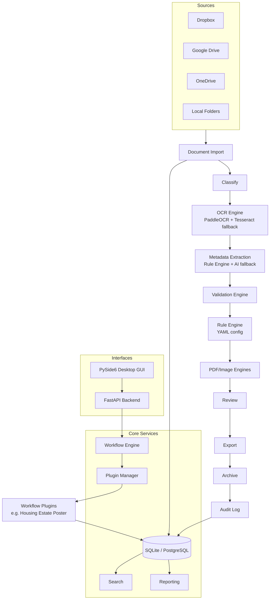

# Architecture

## Overview

## Layers

1. **Core** (`app/core`) — settings, DB session/engine, ORM models, structured
   logging + audit trail, security (JWT auth, password hashing, secret
   encryption, RBAC).
2. **Engines** — single-purpose, stateless-where-possible services:
   - `app/ai` — provider-agnostic AI abstraction (`AIProvider` Protocol) with
     OpenAI / Anthropic / Azure OpenAI / local-LLM backends selected purely by
     configuration (`OAP_AI_PROVIDER`).
   - `app/ocr` — `OCREngine` orchestrates a primary backend (PaddleOCR) with
     automatic image-preprocessing retries and a secondary fallback backend
     (Tesseract), always reporting a confidence score.
   - `app/pdf_engine` — content-stream level text/image replacement (fonts,
     layout and transparency preserved — nothing is rasterized unless asked),
     plus merge/split/insert/delete/rotate/compress/form-fill.
   - `app/image_engine` — resize/crop/align/optimize/validate/preview.
3. **Rule Engine** (`app/rules`) — loads `config/rules/*.yaml` (districts,
   estates, aliases, validation rules, naming patterns, output folders) and
   resolves noisy OCR text to canonical values in three tiers:
   1. **Exact/alias match** — configured name/id/alias found in the text
      (confidence 1.0).
   2. **Fuzzy match** (`app/rules/fuzzy.py`) — `difflib`-based similarity
      scoring across every candidate, picking the single best-scoring
      match (not just the first hit) above a threshold, so OCR noise/typos
      ("Kwun Toung" → "Kwun Tong") still resolve without needing an exact
      string. Short Latin abbreviations (e.g. "ST", "KT") require a
      whole-word boundary match rather than raw substring containment, to
      avoid false positives like "ST" matching inside "estate"; this
      restriction does not apply to CJK aliases, which are unambiguous
      even at 2 characters.
   3. **AI fallback** — only when neither of the above resolves anything,
      and only if a cloud/local AI provider is configured and allowed (see
      `docs/PRIVACY.md`); reported at a fixed, conservative confidence
      (0.6) since it's the least certain tier.

   The resulting per-field confidence (`RuleEngine.last_district_confidence`
   / `last_estate_confidence`) flows into `Document.ai_confidence`, so the
   Review screen shows an honest confidence score rather than a hardcoded
   constant.
4. **Workflow Engine** (`app/workflow`) — runs a `WorkflowContext` through the
   ordered stages (`import → classify → ocr → extract → validate →
   apply_rules → generate → review → export → archive → log`) defined by a
   `WorkflowDefinition` loaded from YAML. Stage handlers are supplied by
   whichever plugin the workflow names — the engine itself never references
   a specific workflow.
5. **Plugin System** (`app/plugins`) — `PluginManager` discovers and
   initializes the plugins listed in `Settings.enabled_plugins`, each
   implementing the `Plugin` protocol (`base.py`). The **Housing Estate
   Poster** plugin is the first concrete implementation; every other
   workflow in the spec (Banner Applications, Government Forms, ...) follows
   the same pattern without touching the engine.
6. **Persistence** — SQLAlchemy models (`Document`, `ProcessingEvent`,
   `WorkflowRun`, `User`, `AuditLog`) support SQLite by default and
   PostgreSQL via a single settings switch; Alembic manages schema
   migrations.
7. **Search** (`app/search`) — a filter object (`SearchFilters`) translated
   into a single SQLAlchemy query covering every field called out in the
   spec (estate, district, workflow, document type, date range, keyword, OCR
   text, politician, reference number, filename).
8. **Interfaces**:
   - `app/api` — FastAPI backend exposing auth, documents, search, workflow
     execution and plugin listing endpoints, secured with JWT + RBAC.
   - `app/gui` — PySide6 desktop shell (Dashboard, Document Explorer with
     drag & drop + progress bar, Workflow Manager, Search, Logs, Settings)
     with light/dark theming, built to call the same core services as the
     API (or the API itself, depending on deployment).

## Error handling philosophy

Every stage failure raises a `WorkflowStageError` (expected, user-facing
reason) or is caught as an unexpected exception — both halt the pipeline,
record a `ProcessingEvent`/`AuditLog` entry, and surface the reason. Nothing
fails silently; there is no "swallow and continue" path anywhere in the
workflow engine.

## Extensibility guarantees

- New workflow = new plugin package + new YAML file. The `WorkflowEngine`,
  `PluginManager`, GUI Workflow Manager and `/api/workflows` endpoint all
  discover it automatically.
- New estate/district/alias/validation rule = YAML edit. No redeploy of
  application code.
- New AI provider = implement `AIProvider` Protocol + one branch in
  `app/ai/factory.py`; consuming code never changes.

## Poster Archive (`app/posters/`, `posters` table)

A second, independent record type alongside `Document`/the workflow
engine - staff paste unstructured text (a title line plus a Dropbox link)
rather than upload a file, so it doesn't go through
import→classify→OCR→extract→validate→generate→review→export→archive at
all. Deliberately its own table rather than another `Document` row:

- **`app/posters/parser.py`** - regex field extraction (date, route
  number, bracketed title, language detection, poster type keywords) plus
  the *same* `RuleEngine.resolve_district`/`resolve_estate` fuzzy/alias
  matching the Housing Estate Poster plugin uses (`app/api/deps.py`'s
  `get_rule_engine()`), so district/estate config lives in one place
  (`config/rules/districts.yaml`/`estates.yaml`) for both features. No AI
  provider involved - deterministic, fast, and free for pastes of hundreds
  of records at once.
- **`app/posters/validation.py`** - Dropbox URL validation, shared by the
  manual create/edit endpoints and the import path.
- **`app/api/routes/posters.py`** - REST CRUD + `/import` (bulk parse and
  insert) + `/search` + `/export` (CSV) + `/bulk-delete`.

**Schema extensibility, without a future redesign**: `posters` already
carries `approval_status` (reusing the same `ApprovalStatus` enum/values
as `documents.approval_status`), `ai_summary`, `ocr_text`, and
`attachments` (a JSON list) - all nullable and unused today, specifically
so that a later automation stage (uploading a generated PDF, running OCR
on a scanned poster, requiring reviewer sign-off) can populate an existing
row's column rather than needing another migration to add it. See
`alembic/versions/0005_poster_archive.py`'s docstring for why it reuses
the existing `approvalstatus` Postgres enum type instead of defining a
second one, and `app/core/models.py`'s `Poster` class docstring for the
full field-by-field rationale.
